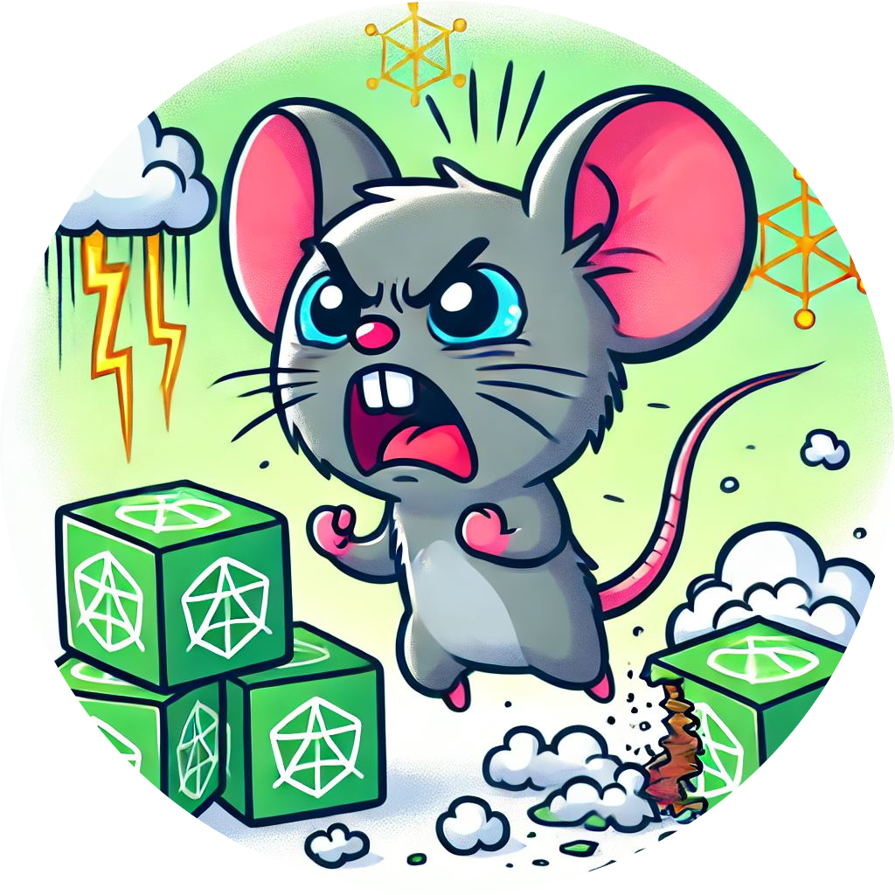

<div align="center">

  

# Custom Culler for Jupyterhub on K8s
I have an Jupyterhub instance that provisions Notebooks for temporary users to try things out in a scratchbook.  
The users are created using the TmpAuthenticator class but the onboard culler wont work for this.  
So this custom culler destroys the notebook pods based on their prefix, after a specific time which can be set via Env var.  

Configurable are: **CULL_THRESHOLD_SECONDS**, **POD_PREFIX**, **POD_NAMESPACE**.  

</div>

## Setup
In the jupyterhub helm-chart use this configuration:
```
hub:
  extraContainers:
    - name: custom-culler
      image: ghcr.io/xamma/jupyhub-custom-culler:latest
      env:
        - name: POD_NAMESPACE
          valueFrom:
            fieldRef:
              fieldPath: metadata.namespace
        - name: POD_PREFIX
          value: "jupyter-x-"
        - name: CULL_THRESHOLD_SECONDS
          value: "3600"
```